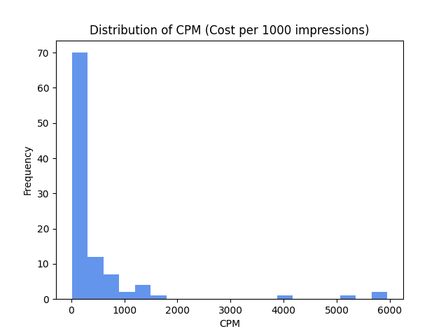
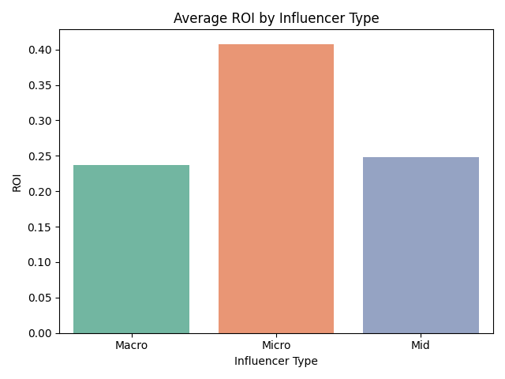

# 💄 Instagram Influencer ROI Analysis for Beauty Campaigns

This project simulates a real-world data analytics scenario where a beauty brand evaluates the performance of 100 Instagram influencers to determine their return on investment (ROI), cost efficiency (CPM), and engagement quality. It’s designed to assist marketing teams in making data-driven decisions for influencer selection.

---

## 📂 Dataset Overview

100 influencer campaign records with the following attributes:

| Column           | Description                                  |
|------------------|----------------------------------------------|
| Influencer       | Instagram handle                             |
| Category         | Product niche (Skincare, Makeup, etc.)       |
| Followers        | Total Instagram followers                    |
| Posts            | Posts made during the campaign               |
| Likes, Comments  | Engagement metrics                           |
| Reach            | Campaign impressions                         |
| Campaign_Cost    | Paid amount for the influencer               |
| Revenue          | Revenue generated from the campaign          |
| Engagement_Rate  | (Likes + Comments) ÷ Followers               |
| CPM              | Cost per 1,000 impressions                   |
| ROI              | (Revenue – Cost) ÷ Cost                      |

---

## 🎯 Project Goals

- Identify **top-performing influencers by ROI**
- Discover **most cost-effective influencers using CPM**
- Explore **relationship between engagement and cost**
- Segment influencers by follower tier to **detect value trends**

---

## 📊 Visual Insights

### 1. 🔝 Top 10 Influencers by ROI
> Who delivered the best bang for the buck?

.png?raw=true)

---

### 2. 📈 Engagement Rate vs Campaign Cost  
> Is high engagement always expensive?

.png?raw=true)

---

### 3. 📉 CPM Distribution  
> How efficiently is the brand spending per 1000 views?



---

### 4. 🔍 Average ROI by Influencer Type  
> Do micro-influencers outperform macros?



---

## 💡 Key Insights

- **Top Performer:** `@influencer_27` with ROI of **2.35** (₹2.35 earned per ₹1 spent)
- **Lowest CPM:** `@influencer_42` with CPM of just **₹124.85**
- **Engagement ≠ Cost:** High engagement was observed even in cost-effective influencers
- **Micro-influencers** (under 100K followers) had the **highest average ROI**, indicating **stronger niche influence** and better campaign returns

---

## 📌 Technologies Used

- **Python** – Core data analysis
- **Pandas, NumPy** – Data wrangling
- **Matplotlib, Seaborn** – Visual storytelling
- *(Optional: Extendable to Streamlit or Power BI)*

---

## 🛠 How to Run

```bash
pip install pandas matplotlib seaborn numpy
python influencer_analysis.py

